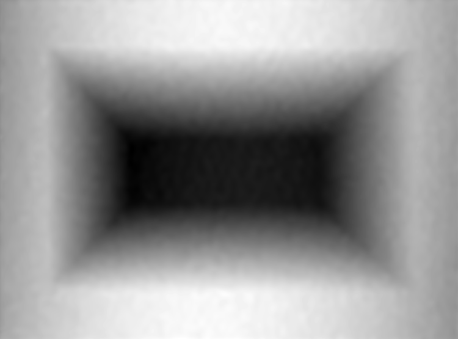

# Phunwrap

This is a command-line tool to perform efficient filtering and unwrapping of wrapped phase
images. It is written entirely in Rust, with the goal of being a single cohesive tool as an
alternative to the various scattered MATLAB implementations of algorithms from the scientific
literature.

Windowed Fourier Filtering and Quality Guided Phase Unwrapping are the 2 core algorithms used,
but a couple of other unwrapping algorithms are included. See [Algorithms](#algorithms) below.

## Basic usage

Run the tool with a wrapped phase input (supports common image formats & numpy .npy) and any
specified output (numpy .npy), and it will proceed with default settings. For example, to
filter without unwrapping we specify only the `-f <FILE>` output:

input: wrapped.png


```
> phunwrap wrapped.png -f filtered.npy
Loaded wrapped phase array of shape (555, 750)
Filtering (1s) [#####################################################] 100% (0s)
Done in 1.0451843 seconds
```

output: filtered.npy


Some improvement clearly, but there is a lot of noise in the original image so we will need
to filter more aggressively. Let's use a large 32x32 filtering window, and while we're at it
we can increase the window stride too, to make filtering run more quickly.

```
> phunwrap wrapped.png -f filtered.npy --wsize 32 --wstride 4
Loaded wrapped phase array of shape (555, 750)
Filtering (0s) [#####################################################] 100% (0s)
Done in 0.42000678 seconds
```

output: filtered.npy


Much nicer! We can proceed with unwrapping now and we should get a good result. Replace the
`-f <FILE>` output with `-u <FILE>` to get the unwrapped phase:

```
> phunwrap wrapped.png -u uphase.npy --wsize 32 --wstride 4
Loaded wrapped phase array of shape (555, 750)
Filtering (0s) [#####################################################] 100% (0s)
Done in 0.42410573 seconds
Unwrapping (0s) [####################################################] 100% (0s)
Done in 0.12089001 seconds
```

output: uphase.npy


Ok... we can't see much here. That's because there's an underlying phase gradient across the
whole image making the result span a very large depth range. What we need to do is remove
that gradient, so we can see just the depth of surface features. This can be done with the
--subtract-plane option:

```
> phunwrap wrapped.png -u uphase.npy --wsize 32 --wstride 4 --subtract-plane
...
```

output: uphase.npy


Looks good.

The tool has overview help text (-h) and detailed help text (--help) which should enable you
to use it without further reference. The overview is reproduced here:

```
Usage: phunwrap [OPTIONS] <WRAPPED>

Arguments:
  <WRAPPED>  Image or numpy array file containing a 2D array of wrapped phases

Options:
  -r, --region <REGION>
          Optional rectangular region to crop the input to, imagemagick-style
          format. E.g. 640x480+100+10 will crop to a 640x480 region starting at
          (100, 10)
      --window-size <WINDOW_SIZE>
          Window size in pixels used for windowed Fourier filtering
          [default: 12] [aliases: wsize]
      --window-stride <WINDOW_STRIDE>
          Shift in pixels from one window to the next
          [default: 1] [aliases: wstride]
  -t, --threshold <THRESHOLD>
          Threshold used for removing Fourier coefficients of small magnitude
          [default: 0.7]
      --unwrap-method <METHOD>
          Method to use for unwrapping the filtered phase
          [default: qgp] [possible values: dct, tie, qgp]
      --subtract-plane
          Subtract a phase ramp, f(x,y) = (ax+by+c)/(dx+ey+1), from the
          unwrapped phase. Coefficients can be supplied with the --plane-coeffs
          option, otherwise they will be found by least-squares fitting to the
          data, and printed
      --plane-coeffs <COEFF> <COEFF> <COEFF> <COEFF> <COEFF>
          The 5 coefficients of f(x,y) = (ax+by+c)/(dx+ey+1).
          See --subtract-plane
  -u, --unwrapped <FILE>
          Output the unwrapped phase
  -q, --quality <FILE>
          Output the image quality map
  -f, --filtered <FILE>
          Output the filtered wrapped phase
  -c, --csv <FILE>
          Output data as a Comma-Separated Value file
      --csv-format <CSV_FORMAT>
          Specify the contents of the CSV file as a character sequence. Valid
          chars are x, y, u (unwrapped), f (filtered), and q (quality). For
          example, pass `--csv-format xyuq` and the CSV file will contain only
          those values and in that order [default: xyufq]
  -h, --help
          Print help (see more with '--help')
```
